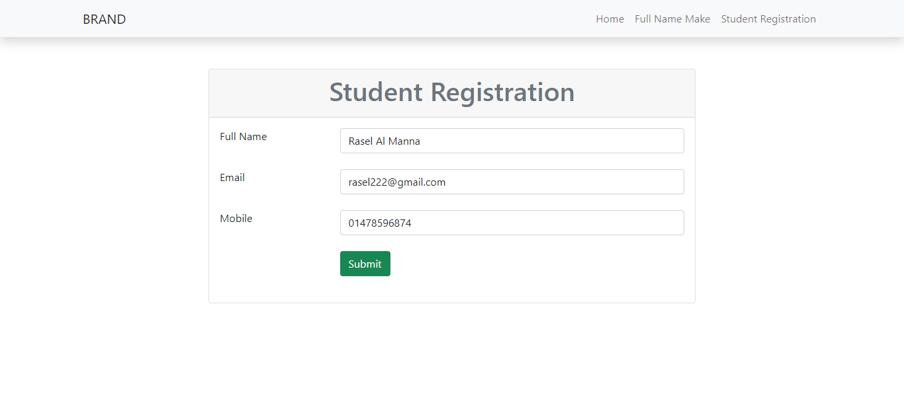
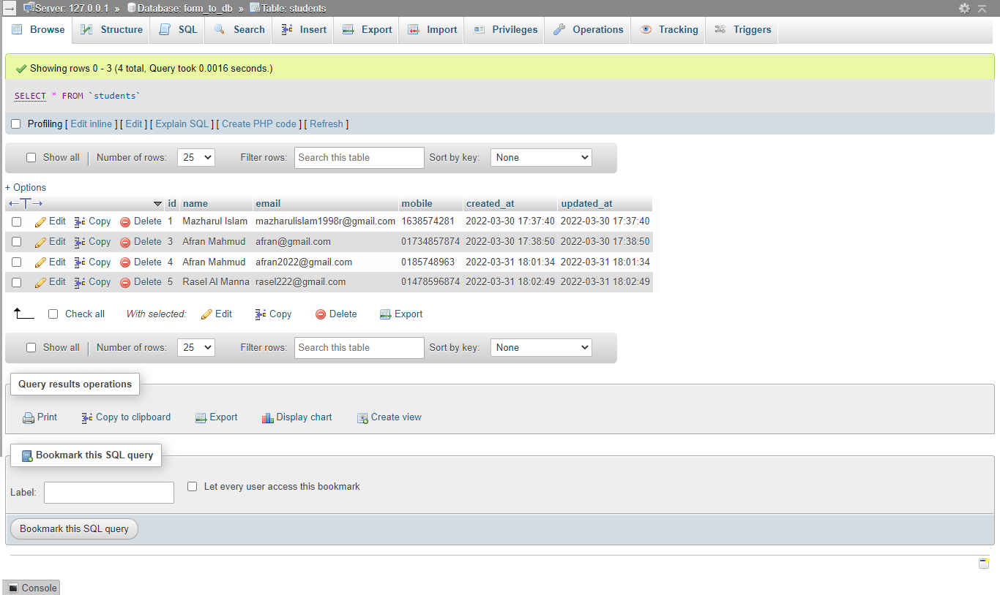
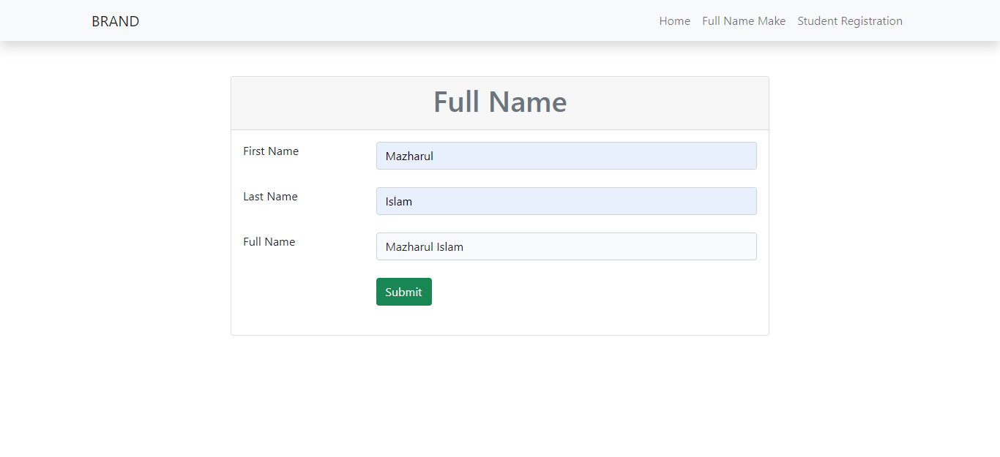

## Receive Data User To Database

<b>Description</b>  
 Welcome to this project. Here I create a simple project, where user data can stored in database. For this job I used Eloquent  ORM. There are also a featured page where User can make full name
 by entering first name and last name. I used post method to do this. 
   
   
#### Technology use
 - Html
 - Bootstrap 5
 - Laravel - 9
 - My-SQL
 
 #### Project Demo
 
 
 
 

##### Thanks For Visit
